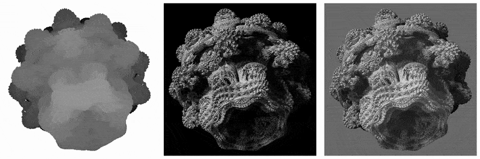
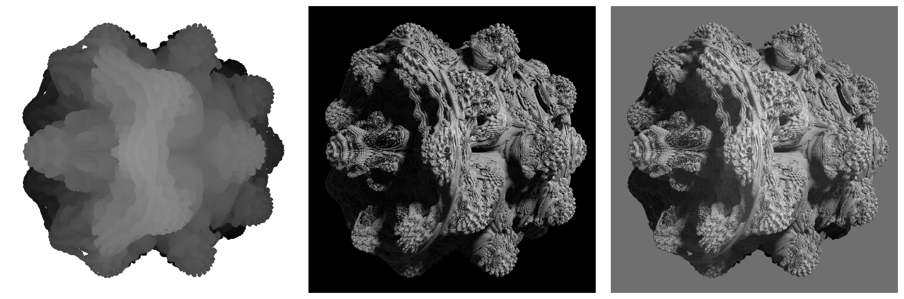
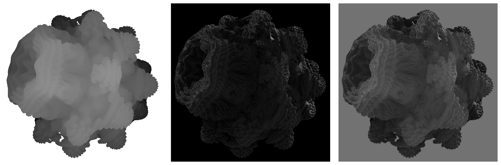

# Mandelbulb Ray Marcher

This codebase renders the Mandelbulb fractal using ray-marching and signed distance fields, with support for taking into account lighting, reflection, and shadow effects.

  
   
  
  

## How It Works

A few concepts come together in this project:

- A camera view is simulated with a field-of-view and position.
- Lighting includes ambient, diffuse, and specular effects, with soft shadows, fog, and reflections.
- Rays march from the camera through the scene, guided by a distance estimator until they hit the fractal surface.

## Gallery

Check out the `gallery/` folder for high-resolution renders and animations.

## License

This project is licensed under the MIT License - see the [LICENSE](./LICENSE) file for details.
